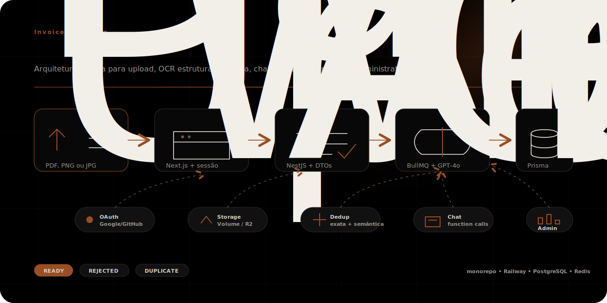

# invoices-ocr-app

OCR + LLM chat sobre invoices — case técnico de OCR.



---

## Documentação da Implementação

> A documentação completa da solução está em [`docs/final-implementation/`](./docs/final-implementation/).
> Baseada 100% na implementação real do código. Inclui arquitetura, tradeoffs, segurança, requisitos principais e roadmap.

- [Visão Geral e Índice](./docs/final-implementation/README.md)
- [Metodologia e Forma de Agir](./docs/final-implementation/01-methodology.md)
- [AI Workflow](./docs/final-implementation/02-ai-workflow.md)
- [Arquitetura da Solução](./docs/final-implementation/03-architecture.md)
- [Autenticação em Detalhe](./docs/final-implementation/03.1-authentication.md)
- [Segurança](./docs/final-implementation/03.2-security.md)
- [Tradeoffs e Evolução v0 → v1](./docs/final-implementation/04-tradeoffs.md)
- [Requisitos Principais](./docs/final-implementation/04.1-upload.md) (Upload, OCR, Chat, Listagem, Download)
- [Incrementos e Melhorias](./docs/final-implementation/05-increments.md)
- [Débito Técnico](./docs/final-implementation/06-technical-debt.md)
- [Features Futuras](./docs/final-implementation/07-future-features.md)

---

## Stack

- Monorepo: npm workspaces + Turborepo
- `apps/web`: Next.js 16 (App Router) + Tailwind v4 + shadcn/ui + next-themes + next-intl (pt-BR)
- `apps/api`: NestJS 11 + Prisma 6 + helmet + Throttler + class-validator + zod + BullMQ
- `packages/shared-types`: DTOs compartilhados
- DB local: Postgres 16 via docker-compose
- Fila local: Redis 7 via Docker (para jobs OCR)
- Deploy: Railway (web + api + Postgres + Redis + Volume)

## Pré-requisitos

- Node 22 (ver `.nvmrc`)
- npm 10+
- Docker + Docker Compose v2
- Redis 7 (para fila OCR local — `docker run -p 6379:6379 redis:7-alpine`)

## Setup local

```bash
# 1) clone, depois na raiz:
nvm use
npm install

# 2) variáveis: um único .env.local na raiz alimenta web e api
cp .env.example .env.local
#    → preencher os secrets (NEXTAUTH_SECRET, GOOGLE_*, GITHUB_*, etc)
npm run env:link
#    → cria symlinks apps/web/.env.local e apps/api/.env apontando
#      pra raiz, então qualquer ferramenta (Next, Nest, Prisma, Playwright)
#      lê a mesma fonte

# 3) sobe Postgres, espera healthcheck, roda migrate (e seed se houver)
npm run db:setup

# 4) sobe web (:3000) e api (:3001) em paralelo
npm run dev
```

> Tanto `.env.local` na raiz quanto os symlinks em `apps/*` são gitignored.
> Em produção (Railway), cada service recebe env vars via dashboard — o
> arquivo local não é usado.

### Auth setup local (F1)

A F1 ativa OAuth Google + GitHub. Antes do primeiro login você precisa:

1. **Gerar `NEXTAUTH_SECRET`** (mesmo valor em web e api):

   ```bash
   openssl rand -base64 32
   ```

2. **Google Cloud Console** → APIs & Services → Credentials → Create OAuth 2.0
   Client ID (Web application). Authorized redirect URI:

   ```
   http://localhost:3000/api/auth/callback/google
   ```

   Copiar Client ID/Secret para `GOOGLE_CLIENT_ID`/`GOOGLE_CLIENT_SECRET` em
   `apps/web/.env.local`.

3. **GitHub** → Settings → Developer settings → OAuth Apps → New OAuth App.
   Authorization callback URL:

   ```
   http://localhost:3000/api/auth/callback/github
   ```

   Copiar Client ID/Secret para `GITHUB_CLIENT_ID`/`GITHUB_CLIENT_SECRET`.

4. **`ADMIN_EMAILS`** (CSV, opcional): e-mails listados são promovidos a `ADMIN`
   no `signIn` callback. Os demais ficam como `USER`.

5. **Smoke**: `npm run dev`, abrir `http://localhost:3000` → redireciona para
   `/login`. Click "Continuar com Google" ou "Continuar com GitHub" → autoriza →
   home com saudação. `curl -i http://localhost:3001/api/v1/me` sem token → 401.

> Em produção (Railway), configurar as mesmas variáveis nos dois services e
> adicionar o domínio Railway às authorized redirect URIs do Google e GitHub.

### OCR setup local (F2)

Por default o dev local roda com `OCR_PROVIDER=mock`: cada upload retorna uma
das 3 fixtures (NF-e, NFS-e, recibo) escolhida pelo SHA1 do arquivo. Permite
desenvolver e rodar a suite E2E sem chave OpenAI nem custo.

Para rodar com OpenAI real, em `.env.local`:

```
OCR_PROVIDER=openai
OPENAI_API_KEY=sk-...
OCR_MODEL=gpt-4o
STORAGE_URL_SECRET=$(openssl rand -base64 32)
VOLUME_ROOT=./.data/volume
```

Custo aproximado: ~$0.01 por documento com `gpt-4o` (vision + structured
output). Em produção (Railway) o `STORAGE_URL_SECRET` precisa ser uma string
estável (não regenerar a cada deploy — invalida URLs assinadas em voo) e o
`VOLUME_ROOT` aponta para o volume Railway montado em `/data`.

### Chat setup local (F3)

Por default o dev local roda com `LLM_PROVIDER=mock`: respostas determinísticas,
sem consumo de tokens. Para rodar com OpenAI real:

```
LLM_PROVIDER=openai
OPENAI_API_KEY=sk-...
CHAT_MODEL=gpt-4o-mini
```

Streaming pode ser ativado com `CHAT_STREAMING=true` (requer `LLM_PROVIDER=openai`).

### Storage dual — Railway Volume vs Cloudflare R2

Por default (`STORAGE_DRIVER=volume`) os arquivos ficam em `./.data/volume`.
Para usar Cloudflare R2 em produção:

```
STORAGE_DRIVER=r2
R2_ACCOUNT_ID=...
R2_ACCESS_KEY_ID=...
R2_SECRET_ACCESS_KEY=...
R2_BUCKET=...
```

A troca é transparente — o `StorageService` abstrai ambos os providers.

### Admin / Benchmark / LLM Configs (F2.5–F3.5)

Usuários com `role=ADMIN` (configurado via `ADMIN_EMAILS`) acessam `/admin`:

- **Métricas:** storage, usuários, custo estimado de IA
- **Benchmark:** rodar extração contra dataset rotulado em `samples/invoice-dataset/`
- **LLM Configs:** versionar prompts do extractor e do chat, ativar por ambiente

O dataset de benchmark é carregado automaticamente se `BENCHMARK_DATASET_DIR`
estiver vazio (resolve para `../../samples/invoice-dataset`).

## Comandos úteis

| Comando                                                                 | O que faz                                                                                                    |
| ----------------------------------------------------------------------- | ------------------------------------------------------------------------------------------------------------ |
| `npm run db:up` / `npm run db:down`                                     | sobe / derruba o container do Postgres                                                                       |
| `npm run db:setup`                                                      | sobe Postgres, aguarda healthy, roda `prisma migrate deploy` (idempotente) e `prisma db seed` se configurado |
| `npm run db:studio`                                                     | abre Prisma Studio em `:5555`                                                                                |
| `npm run lint` / `npm run typecheck` / `npm run build` / `npm run test` | turbo executa em todos os workspaces                                                                         |
| `npm run format` / `npm run format:check`                               | Prettier em tudo                                                                                             |

### Testes

- API (Jest): `npm --workspace=@invoices-ocr/api run test`
- API e2e (Jest + Postgres rodando): `cd apps/api && DATABASE_URL=... npm run test:e2e`
- Web (Vitest + Testing Library): `npm --workspace=@invoices-ocr/web run test`
- Web e2e (Playwright, requer Postgres + envs): `npm --workspace=@invoices-ocr/web run test:e2e`

## Smoke local

- `http://localhost:3000/` sem cookie → redireciona para `/login`.
- Login Google ou GitHub → volta para `/` com saudação "Bem-vindo, ...".
- `curl http://localhost:3001/health` retorna `{"status":"ok","ts":"..."}` (executa `SELECT 1` via Prisma; rota pública).
- `curl -i http://localhost:3001/api/v1/me` sem `Authorization: Bearer` → 401.
- UserMenu (avatar topo direito) → "Sair" → volta para `/login`.

## Deploy

Containers via Dockerfile multi-stage (`apps/web/Dockerfile`, `apps/api/Dockerfile`). `railway.json` declara os 2 services para Railway com healthcheck em `/` (web) e `/health` (api). O api roda `prisma migrate deploy` no startup do container.

## Documentação

### Documentação Final da Implementação (recomendada)

Documentação técnica completa baseada no código real:

| Documento                                                                      | Descrição                                                    |
| ------------------------------------------------------------------------------ | ------------------------------------------------------------ |
| [`README.md`](./docs/final-implementation/README.md)                           | Índice e visão geral                                         |
| [`01-methodology.md`](./docs/final-implementation/01-methodology.md)           | Metodologia, SDD, deploy dia 0, monorepo                     |
| [`02-ai-workflow.md`](./docs/final-implementation/02-ai-workflow.md)           | Como a IA foi integrada ao desenvolvimento                   |
| [`03-architecture.md`](./docs/final-implementation/03-architecture.md)         | Arquitetura geral, pipeline, storage, fila                   |
| [`03.1-authentication.md`](./docs/final-implementation/03.1-authentication.md) | OAuth, JWT, S2S, RBAC, secret fingerprint                    |
| [`03.2-security.md`](./docs/final-implementation/03.2-security.md)             | Ownership, upload validation, LGPD, prompt injection         |
| [`04-tradeoffs.md`](./docs/final-implementation/04-tradeoffs.md)               | Evolução v0 → v1: EventEmitter→BullMQ, Volume→R2, SDK→AI SDK |
| [`04.1-upload.md`](./docs/final-implementation/04.1-upload.md)                 | Upload: XHR progress, magic bytes, fila                      |
| [`04.2-ocr.md`](./docs/final-implementation/04.2-ocr.md)                       | OCR: GPT-4o Vision, Zod, classificação, deduplicação         |
| [`04.3-chat.md`](./docs/final-implementation/04.3-chat.md)                     | Chat: function calling, tool loop, prompts versionáveis      |
| [`04.4-list-view.md`](./docs/final-implementation/04.4-list-view.md)           | Listagem: SSR, polling, preview, edição                      |
| [`04.5-download.md`](./docs/final-implementation/04.5-download.md)             | Download: ZIP com original + OCR + narrativa + chat          |
| [`05-increments.md`](./docs/final-implementation/05-increments.md)             | Benchmark, admin, deduplicação, versionamento de prompts     |
| [`06-technical-debt.md`](./docs/final-implementation/06-technical-debt.md)     | 27 débitos técnicos identificados                            |
| [`07-future-features.md`](./docs/final-implementation/07-future-features.md)   | Roadmap: RAG, multi-provider, streaming real, WhatsApp       |

### Specs e Planejamento (histórico)

- Spec original do case: `docs/invoices-ocr-case-spec.md`
- Plano-mestre das fases: `docs/superpowers/specs/2026-05-07-plano-detalhamento-specs.md`
- Spec F0.5 (Skeleton): `docs/superpowers/specs/2026-05-07-fase-0.5-skeleton.md`
- Spec F1 (Auth): `docs/superpowers/specs/2026-05-07-fase-1-auth.md`
- Spec F2 (OCR): `docs/superpowers/specs/2026-05-07-fase-2-ocr.md`
- Spec F3 (Chat): `docs/superpowers/specs/2026-05-07-fase-3-chat.md`
- Spec F4 (Listagem + Download): `docs/superpowers/specs/2026-05-09-fase-4-lista-download.md`
- Design tokens e mockups: `docs/claude-design/`
